# Loan Approval Analysis for Bank of India

## Overview
The Bank of India provides Loan Services to many customers and are looking for a way to automate the process and find an effective and industrious way to carry out the exercise. This project implements machine learning algorithms to analyzes data from previous clients to identify patterns that can be used to flag an applicant as a risky applicant or 
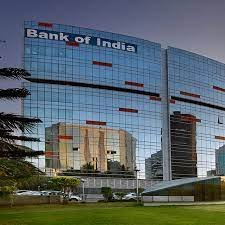

## Business Understanding
The loan approval project aims to significantly enhance the efficiency and accuracy of the loan approval process through advanced machine learning techniques. Faced with challenges such as data quality, the proposed solution focuses on achieving a balance between performance and interpretability. With an accuracy target of 80%, the model is expected to provide reliable predictions that can streamline bank operations, reduce approval times, and maintain fair lending practices. 

### Objectives
* To
* To
* To

## Data Understanding
The Loan Approval Dataset was sourced from Kaggle.The dataset has comprehensive information regarding a loan applicant's financial status, personal attributes such as age and marital status.The dataset has a blend of both numerical and categorical features.
The rows indicate a loan applicant whereas the different columns display information regarding the said applicant having the last column 'Risk_Flag as a binary input to show if the applicant is risky or not

## Data Cleaning
Overall the dataset was pretty clean, did not have any missing, null or duplicate values
The data was split to train and test sets, categorical columns converted to numerical and scaling done to have them all in one scale

## EDA
The dataset was analyzed using various statistical and visualization techniques to understand the distribution of the data and the relationships

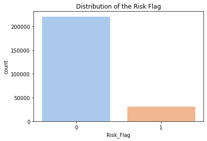
From the display above most of the loan applicants are flagged as non risky

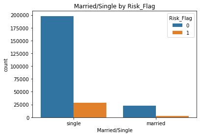
Most loan applicants are single and many of the applicants are flagged as non risky

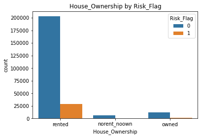
From the analysis done on our dataset, we can see that most of the loan applicants live in rented houses with a few number living in non-rented and non-owned houses whereas less than 25,000 of the applicants live in owned houses

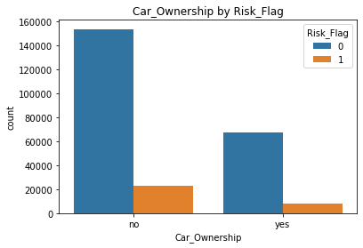
More than 140,000 of the loan applicants do not own a car and are flagged as non risky while the rest who don't own a car are risky.More than 60,00 but less than 80,000 of the applicants own a car and are flagged as non risky applicants

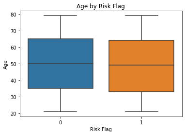
For the age boxplot, there is  a slight variation in the width of the boxes showing younger applicants are more likely to be flagged as risky applicants

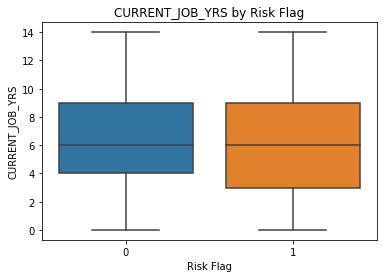
The median current job years is 6years however applicants with short job tenures are flagged as risky applicants

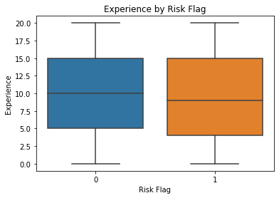
Applicants with more professional experience are deemed as non risky with the median years of experience overlapping between the two groups

## Modeling
Six models were created from the dataset, the baseline model was a simple logistic regression from which we were able to find the best test size to implement
#### a) LogisticRegression

This model had an accuracy score of 55.67%
#### b)Second Logistic Regression
The second model was an iteration of the LogisticRegression model with tuned parameters and had an accuracy score of 52%

#### c) First DecisonTree
The third model was a Decision Tree Classifier which had an accuracy score of 87.1% but proved to be overfiting to the train data

#### d) Second Decision Tree
The fourth model was an iteration of the DecisionTree Classifier with tuned parameters and balanced class weights and had an accuracy score of 54% but did not overfit to the training data
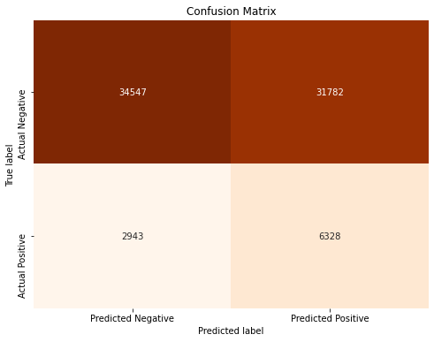
#### e) Random Forest
The fifth model was a Random Forest Classifier which had an accuracy score of 69.52% and did not overfit to the training data
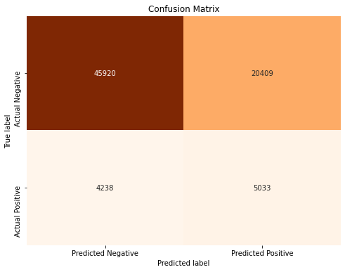
#### f) Gradient Boosting
The last and best performed model was an XGBoost model that implemented gradient boosting algorithm to learn from weaker learner models and produce a strong model with an accuravcy score of 89.3% and did not show signs to overfit to the training data
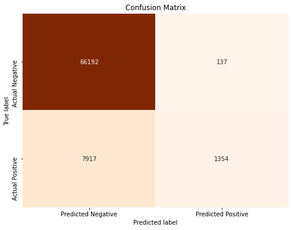
## Recommendation
 * Conduct fairness analysis to prevent discrimination against any group and nsure the model complies with relevant regulations
 * Provide training for stakeholders and implement a feedback mechanism to improve the model continuously
 * Continuously monitor model performance post-deployment and Plan for regular updates and retraining with new data to maintain    accuracy and relevance.
 * Explore the use of advanced machine learning techniques like deep learning to further improve model accuracy and    continuously explore new features that can improve the predictive power of the model.

